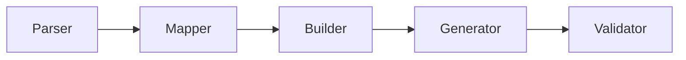

# KSEF2JPK


## KSeF → JPK_V7M program do walidacji i konwersji.

# Spis treści

- [Status projektu](#status-projektu)
- [Funkcje](#funkcje)
- [Pipeline](#pipeline)
- [Architektura projektu](#architektura-projektu)
- [Logika okresu JPK](#logika-okresu-jpk)
- [Obsługa NrKSeF](#obsługa-nrksef)
- [GTU](#gtu)
- [Procedury VAT](#procedury-vat)
- [Faktury korygujące](#faktury-korygujące)
- [Deduplikacja](#deduplikacja)
- [Walidacja](#walidacja)
- [Raporty jakości](#raporty-jakości)
- [Bezpieczeństwo](#bezpieczeństwo)
- [Uwagi dotyczące obliczeń finansowych](#uwagi-dotyczące-obliczeń-finansowych)
- [Znane ograniczenia](#znane-ograniczenia)
- [Development](#development)
- [Quick start](#quick-start)
- [Przykładowe uruchomienie](#przykładowe-uruchomienie)
- [Przykładowy workflow](#przykładowy-workflow)
- [Typowe zastosowania](#typowe-zastosowania)
- [Disclaimer](#disclaimer)
- [CI/CD](#cicd)
- [Licencja](#licencja)
- [Autor](#autor)

Narzędzie napisane w Pythonie do budowy plików **JPK_V7M** na podstawie faktur XML pobranych z systemu **KSeF**.

Projekt analizuje dane z faktur KSeF, mapuje je do ewidencji VAT, wykonuje walidację biznesową oraz generuje poprawny plik XML zgodny ze schemami Ministerstwa Finansów.

---
# Quick start

```bash
git clone ...
cd ...
python -m venv venv
.\venv\Scripts\Activate.ps1
pip install -r requirements.txt
python -m ksef2jpk.main --year 2026 --month 5
```

---
# Status projektu

Projekt przeznaczony jest głównie dla małych firm do:

- automatyzacji przygotowania JPK_V7M,
- walidacji danych VAT,
- kontroli jakości danych księgowych,
- zastosowań wewnętrznych i eksperckich,
- budowy pipeline przetwarzania dokumentów KSeF.

Projekt nie stanowi systemu księgowego ani doradztwa podatkowego.

Niektóre klasyfikacje (GTU, procedury VAT, korekty, przypadki cross-border) wykorzystują logikę heurystyczną i wymagają weryfikacji księgowej przed produkcyjną wysyłką JPK.

---

# Funkcje

Program:

- parsuje faktury XML z KSeF,
- rozpoznaje sprzedaż i zakup,
- mapuje dane do ewidencji VAT,
- buduje strukturę JPK_V7M,
- generuje XML zgodny ze schemą MF,
- wykonuje walidację XSD,
- wykonuje walidację biznesową VAT,
- kontroluje sumy kontrolne,
- wykrywa duplikaty dokumentów,
- rozpoznaje korekty KOR,
- klasyfikuje GTU,
- wykrywa procedury VAT,
- generuje raporty jakości,
- tworzy HTML preview JPK,
- generuje raporty CSV,
- tworzy dane diagnostyczne i audit/debug reports.

---

# Pipeline

```text
KSeF XML
   ↓
Parser
   ↓
FakturaModel
   ↓
GTU / procedures classifier
   ↓
Date filtering
   ↓
Deduplication
   ↓
Mapper
   ↓
Wiersze ewidencji
   ↓
Builder
   ↓
JPKModel
   ↓
Generator XML
   ↓
Validator XSD
   ↓
HTML / CSV / QA reports
```

---

# Architektura projektu

```text
ksef2jpk/
│
├── adapter/        # adaptery i transformacje modeli
├── builder/        # budowa struktur JPK
├── classifier/     # GTU i procedury VAT
├── generator/      # generowanie XML
├── mapper/         # mapowanie ewidencji VAT
├── model/          # modele domenowe
├── parser/         # parsery KSeF XML
├── utils/          # narzędzia pomocnicze
├── validator/      # walidacja XSD i QA
│
├── tests/          # testy
├── tools/          # narzędzia developerskie
└── output/         # wygenerowane raporty/JPK
```

---
## Diagram działania


---

# Logika okresu JPK

Filtrowanie dokumentów do okresu JPK odbywa się według:

- sprzedaż → data sprzedaży,
- zakup → data wpływu/otrzymania,
- data wystawienia używana jest wyłącznie jako mechanizm awaryjny.

Faktury spoza wybranego okresu mogą zostać automatycznie pominięte.

---

# Obsługa NrKSeF

Program preferuje NrKSeF zapisany w XML.

Jeżeli numer nie istnieje w XML, system może:

- odczytać NrKSeF z nazwy pliku,
- oznaczyć dokument jako wymagający weryfikacji.

NrKSeF wykorzystywany jest również do:

- deduplikacji,
- identyfikowalności,
- raportowania jakości.

---

# GTU

GTU emitowane są wyłącznie dla ewidencji sprzedaży.

Program nie przypisuje GTU do ewidencji zakupów.

Klasyfikacja GTU może wykorzystywać heurystyki i wymagać weryfikacji księgowej.

---

# Procedury VAT

Projekt wspiera wykrywanie procedur takich jak:

- MPP,
- WDT,
- EXP,
- OO,
- IMP,
- TP,
- SW,
- EE.

Wykrywanie procedur może być częściowo heurystyczne.

Przypadki eksportowe, importowe i cross-border wymagają kontroli księgowej przed wysyłką produkcyjną.

---

# Faktury korygujące

Projekt rozpoznaje dokumenty typu KOR.

Obsługiwane są m.in.:

- numer dokumentu pierwotnego,
- data dokumentu pierwotnego,
- powód korekty,
- raportowanie korekt.

Złożone przypadki korekt mogą wymagać dodatkowej walidacji księgowej.

---

# Deduplikacja

System wykrywa duplikaty dokumentów.

Priorytet identyfikacji:

1. NrKSeF
2. mechanizm awaryjny do danych faktury

Pominięte duplikaty raportowane są w quality reports.

---

# Walidacja

Projekt wykonuje:

- walidację XML względem schem XSD MF,
- kontrolę sum kontrolnych,
- walidację ewidencji VAT,
- kontrolę spójności danych,
- wykrywanie duplikatów,
- raportowanie ostrzeżeń,
- diagnostykę jakości danych.

---

# Raporty jakości

Program może generować:

- podgląd HTML
- raporty CSV,
- dashboardy jakości,
- raporty walidacji,
- diagnostykę GTU,
- raporty procedur VAT,
- raporty duplikatów,
- raporty korekt,
- audit/debug reports.

---

# 🛡️ Bezpieczeństwo

> [!WARNING]
> Projekt nie wysyła danych do zewnętrznych usług.
> Całość przetwarzania odbywa się lokalnie.

Projekt przetwarza dane podatkowe i księgowe:

- NIP,
- numery faktur,
- NrKSeF,
- dane kontrahentów,
- wartości VAT/netto/brutto.

Nie należy publikować:

- config.json,
- wygenerowanych JPK,
- raportów produkcyjnych,
- danych klientów,
- snapshotów zawierających dane biznesowe.

Przed udostępnieniem danych należy wykonać anonimizację.

---

# Uwagi dotyczące obliczeń finansowych

Historycznie część logiki projektu wykorzystuje typ `float`.

Nowe funkcjonalności finansowe powinny wykorzystywać `Decimal`.

Zmiany dotyczące:

- agregacji VAT,
- sum kontrolnych,
- korekt,
- deklaracji,
- zaokrągleń

powinny być objęte testami regresyjnymi.

---

# Znane ograniczenia

Aktualne ograniczenia projektu:

- część klasyfikacji GTU wykorzystuje heurystyki,
- procedury VAT wymagają weryfikacji księgowej,
- złożone przypadki cross-border mogą wymagać ręcznej kontroli,
- część starszego kodu nadal wykorzystuje float,
- nie wszystkie przypadki KOR są w pełni zautomatyzowane,
- klasyfikacja podatkowa nie zastępuje interpretacji księgowej.

---

# Development

## Wymagania

- Python 3.11+
- pytest
- ruff
- black
- bandit

---

## Instalacja

### Klonowanie repozytorium
```bash
git clone https://github.com/dpolz/ksef2jpk.git
cd ksef2jpk
```
## Środowisko Python

Utworzenie i aktywacja virtual environment:
```bash
python -m venv venv
.\venv\Scripts\Activate.ps1
```
Aktualizacja pip i instalacja zależności:

```bash
python -m pip install --upgrade pip
pip install -r requirements.txt
```

Instalacja narzędzi developerskich:

```bash
pip install -e ".[dev]"
```
---

# Przykładowe uruchomienie

```powershell
python -m ksef2jpk.main --year 2026 --month 5
```

Przykładowy wynik:

```text
Katalog faktur wejściowych:
.../data/input/invoices

Batch ID: <batch-id>

================================================================================
1. PARSOWANIE FAKTUR
================================================================================

[OK] example-invoice.xml
typ='zakup'
nr_ksef='<nr-ksef>'
nip_sprzedawcy='0000000000'
nip_nabywcy='1111111111'
data_wystawienia='2026-05-05'
kontrola_sum=True

================================================================================
2. MAPOWANIE DO WIERSZY EWIDENCJI
================================================================================

[OK] typ='zakup'
netto=108.96
vat=25.06
stawka=23.0

================================================================================
3. BUDOWA JPK
================================================================================

[OK] Zbudowano strukturę JPK.

================================================================================
4. GENEROWANIE XML
================================================================================

[OK] Wygenerowano:
.../JPK/XML/JPK_EXAMPLE_05_2026.xml

================================================================================
5. WALIDACJA XSD
================================================================================

✔ JPK jest poprawny zgodnie z XSD MF
```

## Testy

```bash
pytest
```

---

## Formatowanie kodu

```bash
black .
ruff check .
```

---

## Security scan

```bash
bandit -r ksef2jpk
```

---

# Przykładowy przebieg przetwarzania

```text
1. Pobranie faktur KSeF
2. Parsowanie XML
3. Mapowanie VAT
4. Klasyfikacja GTU/procedur
5. Deduplikacja
6. Walidacja biznesowa
7. Budowa JPK_V7M
8. Generacja XML
9. Walidacja XSD
10. Raporty jakości
```

---

# Typowe zastosowania

Projekt może być wykorzystywany do:

- automatyzacji JPK,
- QA danych księgowych,
- prewalidacji danych VAT,
- budowy pipeline podatkowych,
- integracji z KSeF,
- analiz jakości danych,
- generowania raportów kontrolnych.

---

# ⚠️ Disclaimer

> [!WARNING]
>Autor projektu nie ponosi odpowiedzialności za skutki podatkowe wynikające z błędnej klasyfikacji dokumentów, GTU, procedur VAT lub korekt.

> Wygenerowane pliki JPK powinny zostać zweryfikowane
> przez księgowość lub doradcę podatkowego
> przed wysyłką do Ministerstwa Finansów.

---
## CI/CD

Projekt wykorzystuje GitHub Actions do:
- uruchamiania testów,
- lintingu,
- kontroli jakości kodu.

## Licencja

Projekt jest udostępniany na licencji MIT.

Możesz używać, modyfikować i rozpowszechniać projekt również komercyjnie,
pod warunkiem zachowania informacji o autorze i treści licencji.

Szczegółowe warunki znajdują się w pliku `LICENSE`.

## Autor

Dariusz Polzer
